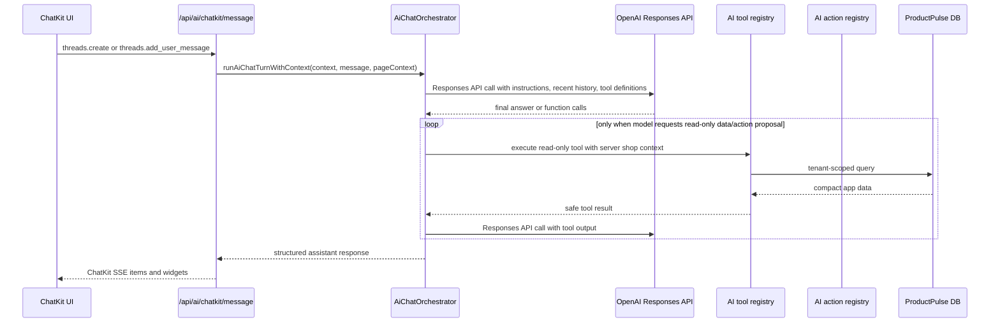

# AI Cost And Call Flow

## Current Runtime Flow

## OpenAI Calls Per User Message

Normal chat message:

- Usually one OpenAI Responses API call if the model can answer without tools.
- Usually two or more calls if the model asks for read-only ProductPulse data: one call to request tools, then one call after tool results.
- Tool calls are capped by `AI_CHAT_MAX_TOOL_CALLS_PER_TURN`.
- Invalid structured output can trigger up to `AI_CHAT_MAX_STRUCTURED_RESPONSE_RETRIES` extra repair call.

Action proposal:

- A normal chat turn may call OpenAI, and the model may request `product_pulse_propose_internal_action`.
- That tool creates a pending server-side action proposal only. It does not execute the action.

Action confirmation:

- ChatKit sends only `proposalId` to the backend.
- The backend reloads and validates the proposal through the internal action registry.
- Confirmation/cancel returns deterministic `action_result` widgets.
- No OpenAI model call is required for confirmation or cancellation.

Hosted workflow status:

- The app does not use Agent Builder hosted workflows.
- `AI_CHATKIT_WORKFLOW_ID` is not part of the default runtime path.
- The browser never receives `OPENAI_API_KEY`.

## Cost Measurement

The orchestrator captures OpenAI `usage` data from every Responses API response in a turn, including tool-loop calls and structured-output retry calls.

Captured fields when available:

- input tokens;
- output tokens;
- cached input tokens;
- reasoning output tokens;
- total tokens;
- model;
- OpenAI response IDs;
- conversation and message IDs;
- shop and user IDs inside server-side trace only;
- estimated USD cost.

Pricing lives in `app/ai/observability/pricing.ts`. Defaults are based on OpenAI standard short-context text prices per 1M tokens from the official pricing page as of May 20, 2026: [OpenAI API pricing](https://platform.openai.com/docs/pricing/). Prices can be overridden with `AI_MODEL_PRICING_JSON` or per-chat price env vars.

## Guardrails

- `AI_CHAT_MAX_TOOL_CALLS_PER_TURN`: caps tool calls per turn.
- `AI_CHAT_MAX_RECENT_MESSAGES`: caps conversation history sent to OpenAI.
- `AI_CHAT_MAX_TOOL_RESULT_CHARACTERS`: caps tool output returned to the model.
- `AI_CHAT_MAX_OUTPUT_TOKENS`: caps model output.
- `AI_CHAT_MAX_STRUCTURED_RESPONSE_RETRIES`: caps format repair calls.
- `AI_CHAT_MAX_ACTION_PROPOSALS_PER_TURN`: caps action proposal cards in one answer.
- `AI_CHAT_OPENAI_TIMEOUT_MS`: caps backend wait time for OpenAI responses.
- `AI_SCOPE_GUARD_ENABLED` and `AI_OUTPUT_GUARD_ENABLED`: optional semantic scope guards. They default off through `AI_SCOPE_GUARD_ENABLED=false`; when enabled, they block only extreme out-of-scope requests and responses before/after the main model call.
- `AI_SCOPE_GUARD_MODEL`: low-cost model used by semantic scope guards.

## Trace Storage

Each assistant message stores a server-side `trace` object in `AiConversationMessage.structuredContent`. The trace includes safe operational metadata, token usage, cost estimate, tool/action counts, validation state, guardrails, and duration.

ChatKit rendering only reads response blocks from `structuredContent`; it does not render the trace.
